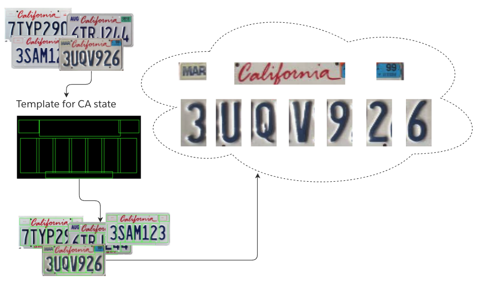
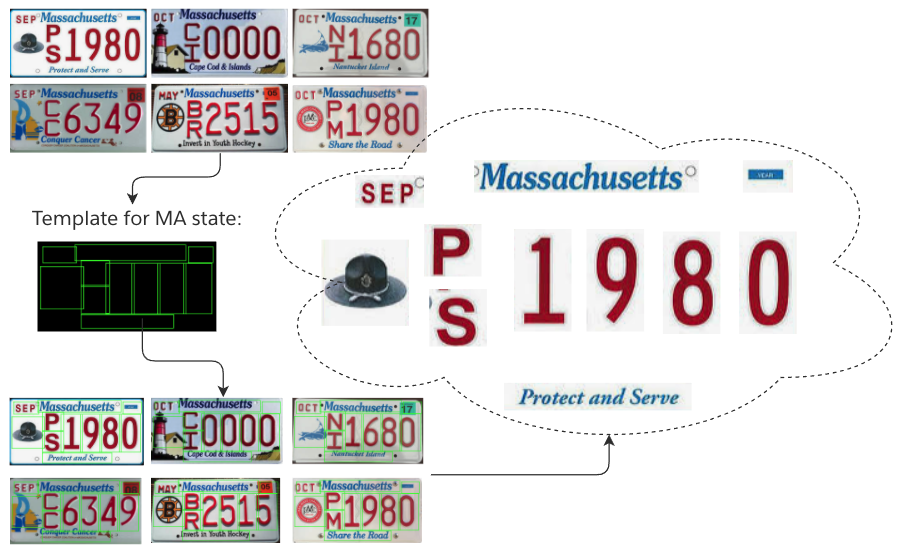

# ALPR templates - scalable approach
Automatic licence plate recognition.

### Description

This document gives an intuition how to apply templates for licence plate recognition. Compared to free text recognition, the problem of license plate recognition has one significant advantage - license plates have a graphical structure.
This allows templates to be used. Templates make the ALPR task scalable to many states and countries. The template is applied after the license plate area is detected, but before the OCR (Character Recognition) algorithm is applied.

***What is template?*** Template is a set of rectangular regions of interest (ROI). Each ROI contains one symbol / character or pattern. Different ROIs can overlap. 

***Why does the template increase the OCR recognition accuracy and performance?*** This increases accuracy because each ROI covers an area slightly more than the symbol in that ROI. This increases performance because ROIs are small areas.

***Why templates make scalability easier?*** Each state or country has one or more templates. See below for examples of CA and MA states. To add license plate recognition for a new state or country, just add a new template.

***How to choose the correct template for a given licence plate?*** Before applying the template, you should run the template recognition model. 

***What other similar tasks are solved using templates?*** Reading banknotes at an ATM or big banknote processing machine. Performance and precision are critical points for banknote reading.

### Example for CA state

### Example for MA state

